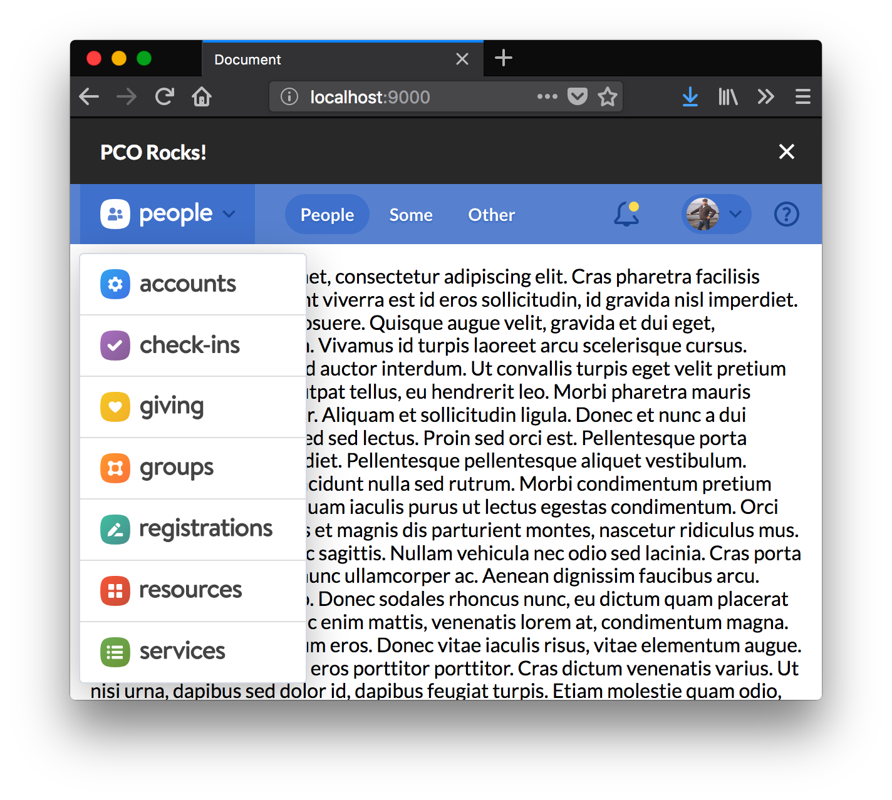

# 7.0.0 (prerelease)

- Add CSRF support to login ([#46](https://github.com/planningcenter/design/pull/46) @danielma)
  - [First implementation in Accounts](https://github.com/ministrycentered/accounts/pull/1877/files)
  - [Second implementation in Giving](https://github.com/ministrycentered/giving/pull/4482/files)

# 6.1.0 (prerelease)

- Add `ProductAnnouncement` component
  - Additional top-level exports:
    - `ProductAnnouncementStyleProvider`
    - `StyledProductAnnouncement`
    - `StyledProductAnnouncementDimissButton`
- `Topbar_ProductAnnouncement` parent selector for styling content
- Fix Announcement topbars to be 14px font-size and 48px absolute height

# 6.0.0

- [BREAKING] modify `/logout` urls to target Login, a2ec71d

# 5.0.0

- [BREAKING] replace Registrations icon
- Add `mapRegistrationsToExpiredRegistrations` to control them

# 4.11.0

- Add `AppsProvider#formatter` and `mapApps`/`mapResourcesToCalendar` formatters to provide a AppsMenu control mechanism to product teams
- Add `.codes` support for `pco-box`

# 4.9.0

- Add support for "Calendar" app

# LOST ENTRIES

# 3.0.0 Release

### Squircle Icons



You've seen them in Slack.
Now you can experience them in your own apps.

SQUIRCLES!

### Support for Church Center and API

Some of our products can't be found in Topbar's app-switcher.
v3 adds support for those non-navigable apps.
Now, these apps can use Topbar **and** keep out of the app-switcher.

### Support for React 16

@glosie gets the badge for first app to React 16.
He also gets a badge for updating Topbar's dependencies, allowing you to upgrade to React 16 too!

🤗

### Various UX fixes

v3 resolves a [long-stading useability bug](https://trello.com/c/PQtq5w1u/2568-%F0%9F%90%9E-previously-logged-in-users-linked-accounts-are-visible-for-a-split-second#) where users could (for a split second) see the `connected_people` from the previous session.

Thanks @mcfadden and @ClaytonRector for surfacing that.

## Upgrade from v2

This should be a mostly painless upgrade.
Here are the APIs that changed and how to update.

### `PlatformAnnouncements`

Platform Announcements were a quickly concieved feature.
The v2 API has a very "build-your-own" feel.
After implementing them across apps, we have a better understanding of what they are and how they should be used.

Now I expose a single component for platform announcements.

```jsx
import { PlatformAnnouncements } from "@planningcenter/topbar";
```

Implemented it in your `{App}Topbar` like so:

```jsx
<PlatformAnnouncement
  data={this.props.platformAnnouncements}
  colors={shared.colors}
  env={shared.env}
/>
```

#### Naming problems

> Didn't these used to `PlatformNotifications`?

Yes 😬

There are a lot of `notification` features in the pipeline.
To distinguish these in Topbar-land, we've written up a [dictionary of terms](https://planningcenter.design/interfaces-and-interactions/announcements-and-notifications-and-alerts-oh-my).

I know that this introduces some cognitive dissonence—now that Topbar uses `PlatformAnnouncements` but `platform_notifications` is used for all the #platform tooling.

I'm sorry.

I knew there was eventually naming problem
but I didn't have a comprehensive solution before the feature needed to ship.
You only know what you know when you know it.

If you find this dissonence problematic, you can assign on import.

```js
import { PlatformAnnouncements as PlatformNotifications } from "@planningcenter/topbar";
```

The props for this componenent are intentionnaly generic (`data`, `renderItem`) to be clear, when referenced by either name.

### `AppsProvider` and `ConnectedPeopleProvider`

These two data-fetching, provider components have new callback signatures.

In adding a `clearCache` method to both, I made the decision to pass objects down instead of functions.
This allows me to add functionality without changing function arity.

Your use of these components should now look like this:

```jsx
<ConnectedPeopleProvider
  render={(connectedPeople, connectedPeopleActions) => (
    <AppsProvider
      render={(apps, appsActions) => (
        /*
         * connectedPeople
         * connectedPeopleActions.fetch()
         * connectedPeopleActions.remove()
         *
         * apps
         * appsActions.fetch()
         * appsActions.remove()
         */
      )}
    />
  )}
/>
```

### `SmallTopbar` and `NotSmallTopbar`

To support the removal of cached `localStorage` data, both Topbars take an additional required props: `requestClearAppsCache` and `requestClearConnectedPeopleCache`.

In practice these callbacks should be provided from `ConnectedPeopleProvider` and `AppsProvider` like so:

```jsx
<ConnectedPeopleProvider
  render={(connectedPeople, connectedPeopleActions) => (
    <AppsProvider
      render={(apps, appsActions) => (
        <SmallTopbar
          requestClearConnectedPeopleCache={connectedPeopleActions.remove}
          requestClearAppsCache={appsActions.remove}
          {...allTheOtherProps}
        />
      )}
    />
  )}
/>
```

### Hit me up

As always, I'm here to help.
Hit me up in Slack if anything in not clear or doesn't work as expected.
